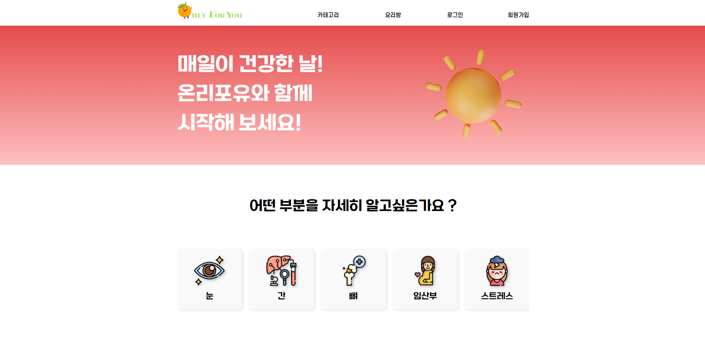

# TEAMPROJECT-PHP

VIEW SITE : http://plove13.dothome.co.kr/php/php/main/main.php)
PHP,MYSQL 를 사용해서 블로그 싸이트를 만들었습니다.

******

사용 스택
---
PHP: 서버 측에서 데이터베이스와의 상호작용, 데이터 처리, 동적 콘텐츠 생성 등을 위해 PHP가 사용되었습니다.   
MySQL 데이터베이스를 사용하여 블로그 게시물과 관련 정보를 저장하고 관리합니다.  
HTML: 웹 페이지의 구조를 정의하는 데 사용됩니다.  
CSS: 웹 페이지의 스타일과 레이아웃을 지정하는데 사용됩니다.  
JavaScript: 클라이언트 측에서 비동기 통신과 유효성 검사 등을 처리하기 위해 사용됩니다.  
jQuery (Ajax를 위해 사용됨): Ajax 호출과 DOM 조작을 간단하게 처리하기 위해 jQuery 라이브러리가 사용되었습니다.  
Ajax: 비동기 통신을 이용하여 서버와 클라이언트 간의 데이터 교환을 위해 사용되었습니다. 회원가입 시 이메일 중복 확인과 닉네임 중복 확인 등의 기능이 Ajax를 통해 구현되어 있습니다.  
정규표현식(RegExp): 사용자 입력값을 검증하는 데에 사용되며, 이메일 형식, 비밀번호 규칙, 생년월일 형식 등을 확인하기 위해 사용되었습니다.  
POST 방식과 GET 방식: POST 방식은 데이터를 HTTP 요청 본문에 담아서 전송하며, GET 방식은 URL 파라미터로 데이터를 전송합니다.  

*******

프로젝트 실행
---
http://plove13.dothome.co.kr/php/php/main/main.php   싸이트에 들어가서 구성 및 사용을 확인해보세요 

